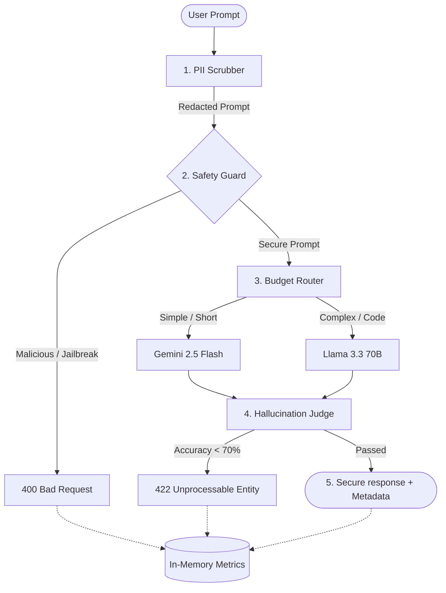

# Gatekeeper AI Governance Proxy

Gatekeeper is a secure, intelligent AI proxy system designed to sit between client applications and downstream Large Language Models (LLMs). It provides a robust pipeline for sanitizing inputs (PII scrubbing), dynamically routing requests based on complexity to minimize costs, and rigorously evaluating outputs via an LLM-as-a-Judge to prevent hallucinations.

---

## System Architecture

The proxy acts as an inline gateway processing all queries through a multi-stage security and governance pipeline.



---

## Core Features & Governance Modules

### 1. PII Scrubber & Sanitization
* **Pre-Pass**: Executes high-speed deterministic regex scrubbers to redact standard emails and phone numbers.
* **LLM Redactor**: Leverages local models (e.g. `gemma4:e2b` via Ollama) with few-shot prompting to identify and redact personal names to `[REDACTED]` without over-scrubbing common nouns or locations (e.g. "strawberry", "Japan").
* **Fail-Safe**: Instantly falls back to local regex-based scrubbing if Ollama is offline.

### 2. Adversarial Safety Shield
* Detects prompt injection, system instruction override ("ignore all rules"), role-play manipulation (DAN), and security bypass attempts.
* Rejects flagged prompts with a `400 Bad Request` before calling any paid API endpoints, saving token budgets from malicious consumption.

### 3. Intelligent Budget Router
* Automatically analyzes prompt word count and complexity (e.g. code keywords, reasoning patterns).
* Routes simple, short requests to **Google Gemini 2.5 Flash** (highly cost-effective).
* Routes complex or programming-related requests to **Llama 3.3 70B via Groq** (high capability).
* Saves up to **80%** on paid API costs.

### 4. Hallucination Judge (Evaluation-as-a-Service)
* Matches user questions against a curated **Golden Set** of facts (fuzzy match threshold of 0.75).
* Employs an LLM-as-a-Judge pattern (`llama3.2` locally) to score the generated response from `0` to `100`.
* Blocks answers scoring below `70%` with a `422 Unprocessable Entity` to prevent hallucinated data propagation.

### 5. Metrics & Telemetry
* Aggregates latency breakdown (scrub, routing, judge, total) and cost efficiency dynamically.
* Logs requests in a thread-safe in-memory registry.
* Exposes execution summaries via a REST API endpoint.

---

## Setup & Running Locally

### Prerequisites
* Python 3.10+
* [uv](https://github.com/astral-sh/uv) (recommended)
* [Ollama](https://ollama.com/) (optional, for local LLM scanning)

### Installation

1. Clone the repository and navigate to the folder:
   ```bash
   cd gatekeeper
   ```

2. Configure environment variables in `.env`:
   ```env
   GOOGLE_API_KEY=your_gemini_api_key
   GROQ_API_KEY=your_groq_api_key
   ```

3. Sync/Install dependencies:
   ```bash
   uv pip install -r pkg_list.txt
   ```

### Running the Proxy

Start the FastAPI gateway:
```bash
uv run uvicorn proxy.main:app --reload
```
The server will start at `http://localhost:8000`.

* **Web UI Dashboard**: Access `http://localhost:8000/` or `http://localhost:8000/dashboard` to view analytics, logs, and interact with the pipeline sandbox.
* **Interactive API Docs**: Access Swagger UI at `http://localhost:8000/docs`.

---

## Command Line Tools & Testing

### 1. Adversarial Shield Evaluation (Red-Teaming)
Run a safety evaluation against 50+ jailbreak prompts from `data/jailbreaks.txt`:
```bash
uv run python -m evaluators.red_team
```
This script tests the safety filters in-process using FastAPI's `TestClient` and saves a structured defense report to `data/red_team_report.json`.

### 2. Hallucination Judge Smoke Test
Run the factual accuracy checker smoke tests:
```bash
uv run python -m evaluators.fact_checker
```

---

## API Endpoints

### `POST /chat`
Submits a user prompt to the governance pipeline.
* **Request**:
  ```json
  { "prompt": "What is the capital of Japan?" }
  ```
* **Response (200 OK)**:
  ```json
  {
    "response": "The capital of Japan is Tokyo.",
    "model_used": "gemini-2.5-flash",
    "redacted_prompt": "What is the capital of Japan?",
    "word_count": 6,
    "is_complex": false,
    "is_malicious": false,
    "factuality": {
      "score": 100,
      "passed": true,
      "reasoning": "The response is factually correct...",
      "matched_question": "What is the capital of Japan?"
    },
    "latency_ms": 124.50
  }
  ```

### `GET /metrics`
Returns aggregated analytics.
* **Response**:
  ```json
  {
    "total_requests": 15,
    "routed_simple": 10,
    "routed_complex": 3,
    "blocked_malicious": 2,
    "total_savings": 0.00588,
    "safety_rate": 100.0,
    "average_latency": 142.10,
    "average_factuality": 94.5,
    "recent_requests": [...]
  }
  ```
